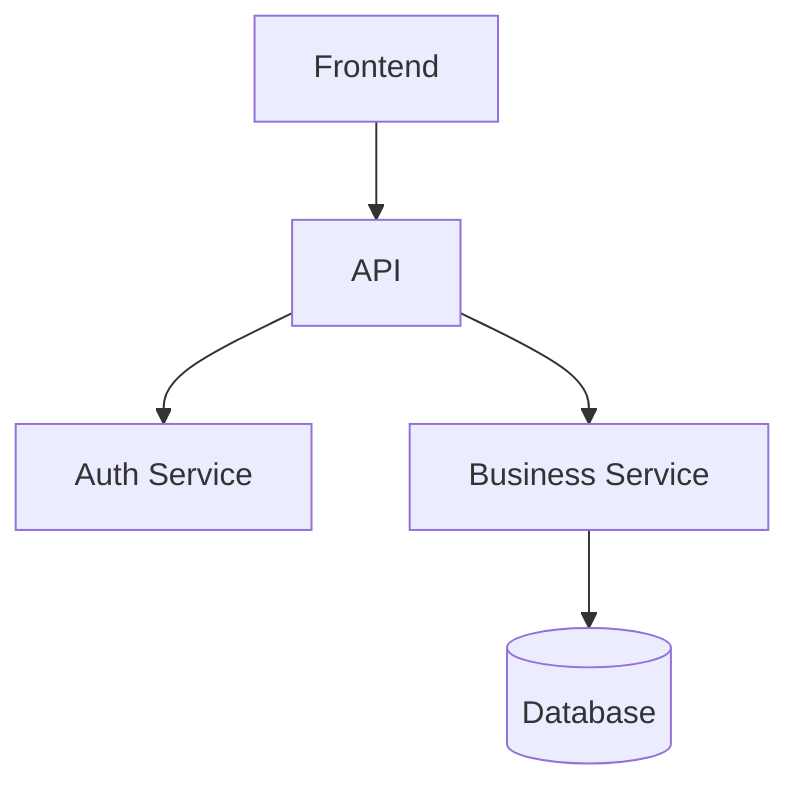

# Harnesses Detail — Harnesses Secundarios

Este archivo contiene los harnesses que el orquestador carga bajo demanda cuando la situación lo requiere. No son parte del flujo principal de cada sprint pero son críticos en situaciones específicas.

---

## H-DELEGATION — Aislamiento de Sub-Agentes

Cuando delegues trabajo a un sub-agente o skill externo:

1. **Contexto mínimo únicamente** — no arrastres toda la conversación padre
2. **Define el output antes de delegar** — el sub-agente debe saber exactamente qué entregar
3. **Valida el resultado** contra el H-CONTRACT antes de aceptarlo
4. **No pases el SKILL.md completo** — compacta solo las reglas relevantes para esa tarea

Formato de briefing para sub-agente:
```
Tarea: [descripción concreta]
Tipo de proyecto: [tipo]
Stack/herramientas: [solo las relevantes]
Artefacto de entrada: [ruta o contenido]
Resultado esperado: [artefacto o acción concreta]
Restricciones: [solo las que afectan esta tarea]
Sprint actual: [N] | Goal: [Sprint Goal]
```

---

## H-SCOPE — Evaluación de Tamaño de Entrega

Antes de cualquier APPLY grande, evalúa:

**Para software:**
- ¿El cambio supera 400 líneas? → Proponer partir
- ¿Toca más de 5 módulos distintos? → Necesita estrategia de entrega
- ¿Cambia una interfaz pública (API, esquema de BD)? → Versioning y comunicación
- ¿Toca migraciones ya aplicadas en producción? → Revisión humana obligatoria

**Para todos los proyectos:**
- ¿El entregable es tan grande que no puede revisarse en una sesión? → Partir
- ¿Toca más de 3 áreas o stakeholders distintos? → Comunicar antes de aplicar
- ¿Hay efectos secundarios en otros entregables del sprint? → Documentar dependencias

Si el cambio es demasiado grande:
> "Este entregable es grande para revisarse de una vez. Propongo dividirlo en [N] partes: [lista]. ¿Con cuál empezamos?"

---

## H-ROUTING — Selección de Modelo por Tarea

Guía para elegir el modelo/agente apropiado según el tipo de tarea:

| Tipo de tarea | Complejidad | Modelo sugerido |
|---------------|-------------|-----------------|
| Búsqueda de archivos, exploración | Baja | Haiku / modelo rápido |
| Generación de spec / historias | Media | Sonnet |
| Arquitectura / decisiones críticas | Alta | Opus |
| Verificación con evidencias | Media | Sonnet |
| Code review / quality review profundo | Alta | Opus |
| Sub-agente implementador (tarea aislada, clara) | Variable | Modelo según complejidad de la tarea |
| Debugging complejo | Alta | Opus |

---

## H-ISOLATION — Aislamiento de Perfiles

Cada proyecto es un perfil aislado. Nunca mezcles:
- Configuraciones de `.sdd/config.json` de proyectos distintos
- Decisiones del `engram.json` de proyectos distintos
- Stack detectado en sesiones de otro proyecto

Si detectas contaminación de contexto:
> "El contexto parece mezclar información de proyectos distintos. Voy a trabajar exclusivamente con [proyecto actual según config.json]. ¿Confirmas?"

Señales de contaminación:
- El usuario menciona un nombre de proyecto diferente al de `config.json`
- Aparecen artefactos de rutas que no existen en el proyecto actual
- Las tecnologías mencionadas no coinciden con el stack registrado

---

## H-SAFETY — Backup y Rollback

### Antes de cambios destructivos

Verifica si existe un backup reciente. Si no:
> "No detecto copia reciente de [archivo/módulo]. ¿Hacemos una antes de proceder?"

Backup mínimo: copia en `.sdd/backups/[fecha-ISO]/[nombre-archivo]`.

Cambios que siempre requieren backup:
- Eliminar archivos del proyecto
- Modificar el esquema de base de datos (en producción)
- Cambiar una API pública que otros sistemas consumen
- Reemplazar configuraciones de entorno de producción

### Si VERIFY falla en algo crítico

Presenta las tres opciones siempre:
1. **Corregir ahora**: qué cambiar específicamente y cómo
2. **Rollback parcial**: qué archivos/cambios revertir y cómo
3. **Deuda documentada**: registrar en backlog como `BUG-NNN` o `DEUDA-NNN` y continuar

Nunca dejes el proyecto en estado de fallo sin que el usuario haya elegido una de estas tres opciones.

---

## H-DEPENDENCY — Grafo de Dependencias

Para proyectos con múltiples componentes interdependientes, mantén actualizado el grafo en `docs/sdd/design.md`:

**Software:**


**Otros proyectos (ejemplo: marketing):**
```
Estrategia → Creatividades → Producción → Publicación → Análisis
                ↑                            ↓
           Brand Guidelines            Métricas → Optimización
```

Antes de aplicar cualquier entregable, verifica: ¿el cambio rompe alguna dependencia aguas abajo?

---

## H-RECOVERY — Recuperación tras Compactación de Sesión

Si el contexto de la sesión fue comprimido o la sesión se reinició:

1. Lee inmediatamente: `.sdd/config.json`, `.sdd/phase-status.json`, `.sdd/engram.json`
2. Reconstruye el estado mínimo: proyecto, fase actual, sprint activo, skills integrados
3. Informa al usuario:
   > "El contexto fue comprimido. Reconstruí el estado desde los artefactos. Estamos en fase [X], sprint [N], proyecto [Y]. ¿Esto es correcto o hay cambios recientes que deba saber?"
4. No inventes información que no esté en los artefactos. Si algo no está en los archivos, pregunta.
5. Carga del engram solo lo relevante para la tarea actual, no todo.
